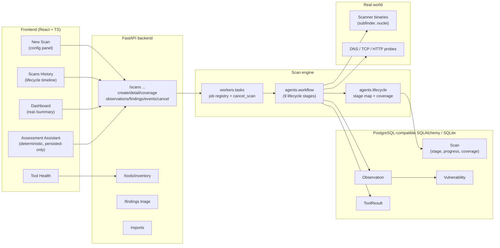

# Phase 4 — System Architecture

**Date:** 2026-09-19
Companion to: `docs/PHASE_4_IMPLEMENTATION.md`, `docs/PHASE_4_TOOL_MATRIX.md`.

## Data flow (one scan job)

```
Browser (React/Vite)
   │  POST /scans {target, tools{...}, severity, profile}
   ▼
FastAPI  app/api/scans.py  (_create_and_enqueue)
   │  scope check (Project.scope_json OR discovered Assets)
   │  -> Scan row (status=Pending, stage=queued, scan_config incl simulation)
   ▼
app/workers/tasks.py  trigger_background_scan(scan_id, simulation, config)
   │  ThreadPoolExecutor -> ScanJobRegistry
   ▼
app/agents/workflow.py  orchestrate_scan
   │  per plan: stage_progress(stage) -> run tool -> complete
   │  stages: starting recon discovery service_scan http_scan
   │          vulnerability_scan analysis reporting
   │  out-of-scope discovered hosts skipped (_in_scope_hosts)
   ▼  (real mode)
app/tools/scanner_tools.py adapters  --->  NOT INSTALLED / Completed / Failed (honest)
app/tools/real_probes.py (stdlib)    --->  Observation rows
app/assess/finding_rules.py          --->  Vulnerability rows (evidence-linked)
   ▼
Scan.progress / Scan.coverage / Scan.stage updated on every change
   │  SSE pollers read persisted rows only
   ▼
GET /scans/{id}/events (typed: stage, tool, finding, progress, done, error)
GET /scans/{id}/coverage | /observations | /findings | /scans/coverage
GET /tools/inventory (shutil.which + version probe)
POST /scans/{id}/cancel -> cancel_scan -> ScanCancelled unwinds cooperatively
```

## Component diagram



## Key honesty guarantees

1. **No observation ⇒ no finding** (finding_rules over persisted observations only).
2. **NOT INSTALLED tools never fabricate output** and never inflate coverage.
3. **Coverage ≠ score.** Coverage is `completed/planned` tasks; `security_score` is risk
   from persisted findings (starts 100, deducts per open severity).
4. **SSE events are change-only**, derived every 0.5s from persisted rows.
5. **Cancellation is cooperative:** `ScanCancelled` unwinds between stages/tools; a
   registry + `cancel_requested` flag prevent zombie tasks.
6. **Two-user isolation:** every route resolves scans/assets via the authenticated user's
   own projects (`get_owned_scan`, project-scoped filters).

## Frontend routes

| Path | Page | Backend source |
|------|------|----------------|
| `/` | Dashboard | `GET /scans/summary`, `/scans/list` |
| `/scan/new` | New Scan (config + SSE) | `POST /scans`, `GET /scans/{id}/events`, `/scans/scope` |
| `/scans` | Scans History (timeline) | `GET /scans/{id}`, `/{id}/coverage`, `/{id}/cancel` |
| `/assets` | Assets / topology | `GET /auth/assets` |
| `/reports` | Reports | `GET /reports/*` |
| `/chat` | Assessment Assistant | `POST /chat/query`, `/chat/history/{id}` |
| `/knowledge` | Knowledge Base | static (educational) |
| `/tools` | Tool Health | `GET /tools/inventory` |
| `/settings` | Settings | `GET /auth/me` |